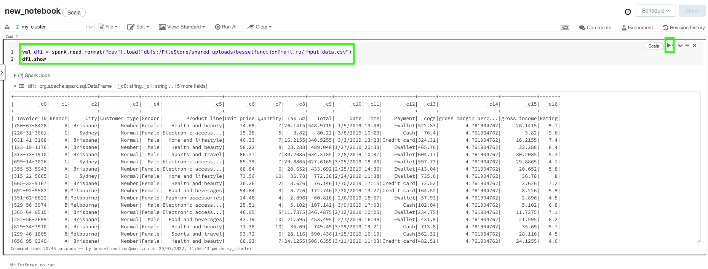

# Congratulations, you are a junior Data Engineer at Superstore!

We begin from creating cluster using Azure Databricks
On the left hand side at the tab bar: `Create -> Cluster -> enter name -> choose tech spec of cluster as per screenshot -> click Create Cluster`


Now we can create a Notebook
On the left hand side at the tab bar: `Create -> Notebook -> enter name, choose Scala and your cluster -> click Create`


Download the data for your warehouse

open this link in your browser
https://github.com/DanyMariaLee/data_eng_bootcamp_0/blob/main/data/input_data.csv

(This is raw CSV data of sales stats that we will be using in this class)

Right click on window "save as..." and save it as input_data.csv on your computer. We will use it in a minute.


Now let's ingest data!

Left tab -> Workspaces -> choose your workspace
Click file -> Upload data


then drag and drop our input_data.csv


And here click "copy" to get the code snippet to read the file


Look at the code snippet to read data - it contains email. Please note, in the following code everywhere you should replace my email with your own, because this is the address of the file created under your user account. You can't access mine, and no one can access yours.


Paste copied code into the console


Before we run it let's look at the line of code and learn what it actually does

```scala
val df1 = spark.read.format("csv").load("dbfs:/FileStore/shared_uploads/besselfunction@mail.ru/input_data.csv")
```
- spark - is Spark Session
- read - reads the data
- format - you provide info about the format of the data you are reading (csv, parquet)
- load parameter has to contain full path to the data
- df1 is a DataFrame

A Spark DataFrame is an integrated data structure with an easy-to-use API for simplifying distributed big data processing. 

Now we going to look at the data. Call functions `show` on your dataframe

```scala
df1.show
```



If you look carefully you'll notice, that the column names are messed up: _c0, _c1...

Let's fix it by adding options to our data reading function
```scala
.option("header", "true")
```
so the result code snippet will be
```scala
val df1 = spark.read.format("csv").option("header", "true").load("dbfs:/FileStore/shared_uploads/besselfunction@mail.ru/input_data.csv")
df1.show
```

Let's execute it and see

[Image](./pictures/df1_show_2.png)

Now we can find out how many row of data do we have
```scala
df1.count
```

Before executing the code please comment out the df1.show line, we don't need it right now.

[this screenshot is too wide and will open in new window](./pictures/df1_count.png)

Now we can see there are transactions from different Product lines, can we find out in how many f them we have in our stores?

```scala
df1.select("Product line").distinct.show

+--------------------+
|        Product line|
+--------------------+
|  Home and lifestyle|
| Fashion accessories|
|   Health and beauty|
|Electronic access...|
|  Food and beverages|
|   Sports and travel|
+--------------------+
```

To have a clear idea of what columns we have we can call function df1.printSchema
```
root
 |-- CustomerID: string (nullable = true)
 |-- Product line: string (nullable = true)
 |-- Unit price: string (nullable = true)
 |-- Quantity: string (nullable = true)
 |-- Tax 5%: string (nullable = true)
 |-- Total: string (nullable = true)
 |-- Date: string (nullable = true)
 |-- Time: string (nullable = true)
 |-- Payment: string (nullable = true)
 |-- cogs: string (nullable = true)
 |-- gross margin percentage: string (nullable = true)
 |-- gross income: string (nullable = true)
 |-- Rating: string (nullable = true)

df1: org.apache.spark.sql.DataFrame = [CustomerID: string, Product line: string ... 11 more fields]
```

Now that we can calculate distinct values in any column let's find out how many unique customers we have

```scala
df1.select("CustomerID").distinct.count

res15: Long = 99
```

What is total $ each customer spend with us?
```scala
df1.groupBy(“CustomerID").sum("Total").show

AnalysisException: "Total" is not a numeric column. Aggregation function can only be applied on a numeric column.
```

This is happening because our schema has type string on column Total. We can fix that and calculate total spend using two options:
```
// Use column we created with correct type - column t

df1.withColumn("t", col(“Total").cast("integer")).groupBy("CustomerID").sum("t").show

// OR drop old column and rename new one to Total

df1.withColumn("t", col("Total").cast("integer")).drop("Total").withColumnRenamed("t", "Total").groupBy("CustomerID").sum("Total").show
```

result will be the same
```
+-----------+------+
| CustomerID|sum(t)|
+-----------+------+
|756-01-7507|  3456|
|829-34-3910|  3344|
|299-46-1805|  4175|
|617-15-4209|  2888|
|865-92-6136|  2538|
|853-23-2453|  3079|
|225-32-0908|  4110|
|232-11-3025|  5203|
|120-06-4233|  3968|
|319-50-3348|  2807|
|370-41-7321|  2602|
|382-03-4532|  2615|
|252-56-2699|  4290|
|354-25-5821|  3769|
|227-03-5010|  2686|
|315-22-5665|  4324|
|393-65-2792|  2951|
|838-78-4295|  3779|
|669-54-1719|  1652|
|692-92-5582|  2482|
+-----------+------+
only showing top 20 rows
```

Can you find customer who spend more than anyone else? 

This can be done in two steps:

1) we will use function from previous step to create new aggregated dataset
2) looking at the output of previous calculation we can see that the result of the sum function has name sum(t) or sum(Total) depending on which way you decided to go - we should rename that column for readability and future use
3) we can use order function to answer our question, for us to have the maximum value on the top of the pile we need to use descending ordering
```scala
// this is adding all the function from the package functions including desc
// if you want to only import the ones you use right now type import org.apache.spark.sql.functions.{col, desc}
import org.apache.spark.sql.functions._ 

df1.withColumn("t", col("Total").cast("integer")).drop("Total").withColumnRenamed("t", "Total").groupBy("CustomerID")
.sum("Total").withColumnRenamed("sum(Total)", "sum_total").orderBy(desc("sum_total")).show
```

Can we find what are the least popular Product line for this spender?

```scala
// lets select the CustomerID for this spender
val maxSpenderId = df1.withColumn("t", col("Total").cast("integer"))
.drop("Total")
.withColumnRenamed("t", "Total")
.groupBy("CustomerID")
.sum("Total")
.withColumnRenamed("sum(Total)", "sum_total")
.orderBy(desc("sum_total"))
.select("CustomerID")
.as[String]
.collect
.head 
// using .head in the end is not the best way to do it, if you do not have a result value this function will fail.
// as an exercise - find a better way to do it

res5: String = 750-67-8428

```

Now we can select a set of data related only to this customer
```scala
df1
.filter(df1("CustomerID") === “750-67-8428”)
.withColumn("t", col("Total").cast("integer"))
.drop("Total")
.withColumnRenamed("t", "Total")
.groupBy("Product line")
.sum("Total")
.withColumnRenamed("sum(Total)", "sum_total")
.orderBy(desc("sum_total"))
.select("Product line", "sum_total")
.show

+——————————+---------+---------+ 
|        Product line|sum_total|
+--------------------+---------+
|  Home and lifestyle|     2140|
|  Food and beverages|     1570|
|   Health and beauty|     1077|
|Electronic access...|      657|
|   Sports and travel|      432|
| Fashion accessories|      193|
+--------------------+---------+
```

Useful hint: before reading the solution try to put together the code yourself

Can you find customer who spends more than anyone else between 2 and 5 PM? 

```scala
// first we need to filter the data where Time column is between 2 and 5 PM
// lets add column that will contain only the hour of transaction
import org.apache.spark.sql.functions._ 


df1
.select(col("*"), substring(col("Time"), 1, 2).as("hour").cast("integer"))
.filter(col("hour") >= 14 && col("hour") <= 17)
.withColumn("t", col("Total").cast("integer"))
.drop("Total")
.withColumnRenamed("t", "Total")
.groupBy("CustomerID")
.sum("Total")
.withColumnRenamed("sum(Total)", "sum_total")
.orderBy(desc("sum_total"))
.show

+-----------+---------+
| CustomerID|sum_total|
+-----------+---------+
|355-53-5943|     3071|
|732-94-0499|     3003|
|871-39-9221|     2612|
|145-94-9061|     2552|
|565-80-5980|     2272|
|574-22-5561|     2265|
|333-73-7901|     2133|
|870-72-4431|     2060|
|347-34-2234|     2040|
|730-50-9884|     1955|
|750-67-8428|     1923|
|727-46-3608|     1871|
|756-01-7507|     1848|
|371-85-5789|     1831|

```

Now let's import another data file from here https://github.com/DanyMariaLee/data_eng_bootcamp_0/blob/main/data/reference_data.csv using the beginning of this tutorial.
Save it as reference_data.csv

Let's read this data

```scala
val df2 = spark.read.format("csv").option("header", "true").load("dbfs:/FileStore/shared_uploads/besselfunction@mail.ru/reference_data.csv")
df2.show

+-----------+--------+-----+------+---+
|  person_id|postcode|state|gender|age|
+-----------+--------+-----+------+---+
|750-67-8428|    2000|  NSW|     F| 19|
|226-31-3081|    2000|  NSW|     F| 22|
|631-41-3108|    2000|  NSW|     M| 32|
|123-19-1176|    2000|   WA|     M| 32|
|373-73-7910|    2000|   WA|     M| 32|
|699-14-3026|    2000|   WA|     M| 32|
|355-53-5943|    2000|   WA|     M| 32|
|315-22-5665|    2000|  NSW|     M| 32|
|665-32-9167|    2000|  NSW|     M| 22|
|692-92-5582|    2000|  NSW|     M| 22|
|351-62-0822|    2000|  NSW|     M| 22|

```
In what state leaves a person who spends the least between 1 and 2PM?
```scala
// first we need to reuse previous function to filter data between 1 and 2 PM
import org.apache.spark.sql.functions._ 

df1
.select(col("*"), substring(col("Time"), 1, 2).as(“hour”).cast(“integer"))
.filter(col(“hour”) >= 13 && col(“hour”) <= 14)
.withColumn("t", col(“Total").cast("integer"))
.drop(“Total")
.withColumnRenamed("t", “Total")
.groupBy("CustomerID")
.sum(“Total")
.withColumnRenamed("sum(Total)", “sum_total”)
.orderBy(“sum_total")
.select("CustomerId")
.as[String]
.collect
.head

minSpender: String = 132-32-9879

```

Now we can fin that customer in reference dataset and select the state column
```scala
// check out the schema first
df2.printSchema

root
 |-- person_id: string (nullable = true)
 |-- postcode: string (nullable = true)
 |-- state: string (nullable = true)
 |-- gender: string (nullable = true)
 |-- age: string (nullable = true)
```
and finally
```scala
df2.filter(col("person_id") === "132-32-9879").select("state").show
```

Filter customers that payed more than 1000$ with cash in total spendings?
```scala

df1.filter(col("Payment") === "Cash")
.withColumn("t", col("Total").cast("integer"))
.drop("Total")
.withColumnRenamed("t", "Total")
.groupBy("CustomerID")
.sum("Total")
.withColumnRenamed("sum(Total)", "sum_total")
.filter(col("sum_total") >= 1000)
.join(df2, df1("CustomerID") === df2("person_id"))
.drop("CustomerID")
.show

+---------+-----------+--------+-----+------+---+
|sum_total|  person_id|postcode|state|gender|age|
+---------+-----------+--------+-----+------+---+
|     1293|756-01-7507|     822|   NT|     F| 52|
|     1590|829-34-3910|    2000|  NSW|     F| 42|
|     1365|299-46-1805|    2000|  NSW|     F| 19|
|     1165|853-23-2453|    2000|   WA|     M| 32|
|     2801|232-11-3025|    2000|  NSW|     M| 22|
|     2456|120-06-4233|     822|   NT|     F| 42|
|     1301|382-03-4532|    2000|  NSW|     M| 22|
|     1610|252-56-2699|    2000|  NSW|     F| 42|
|     2582|354-25-5821|    2000|  NSW|     F| 42|
|     1885|692-92-5582|    2000|  NSW|     M| 22|
|     1752|732-94-0499|    2000|  NSW|     F| 22|
|     1612|228-96-1411|    2000|  NSW|     F| 42|
|     1579|640-49-2076|    2000|  NSW|     M| 32|
|     2678|365-64-0515|    2000|  NSW|     F| 42|
|     1473|280-35-5823|    2000|  NSW|     M| 22|
|     1094|329-62-1586|     822|   NT|     F| 22|
|     1051|574-22-5561|     822|   NT|     F| 52|
|     1031|847-38-7188|     822|   NT|     M| 52|
|     1901|699-14-3026|    2000|   WA|     M| 32|
|     1614|777-82-7220|    2000|  NSW|     M| 22|
+---------+-----------+--------+-----+------+---+
only showing top 20 rows

```

Filter customers who are from NSW, spend less than 500$ with Credit card and are in the age box [25-35]

answer is single person
```
+---------+-----------+--------+-----+------+---+
|sum_total|  person_id|postcode|state|gender|age|
+---------+-----------+--------+-----+------+---+
|      287|873-51-0671|    2000|  NSW|     M| 32|
+---------+-----------+--------+-----+------+---+
```
