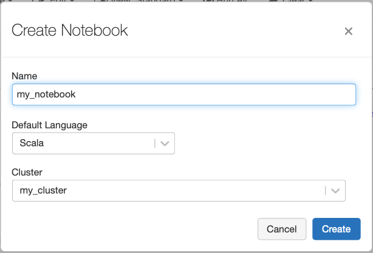

# Congratulations, you are a junior Data Engineer at Superstore!

We begin from creating cluster using Azure Databricks

Now we can create a Notebook
On the left hand side at the tab bar: `Create -> Notebook -> enter name, choose Scala and your cluster -> click Create`

