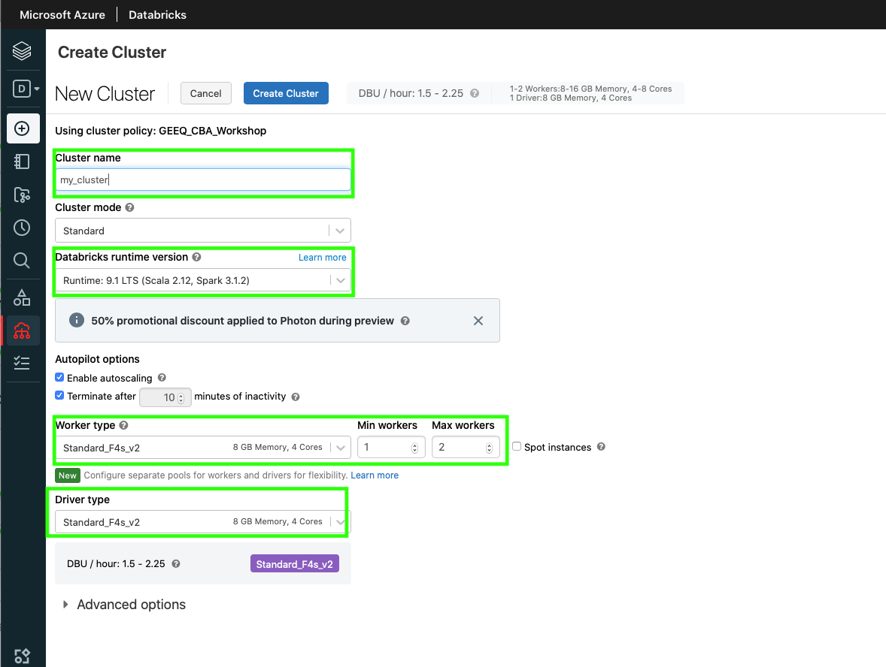
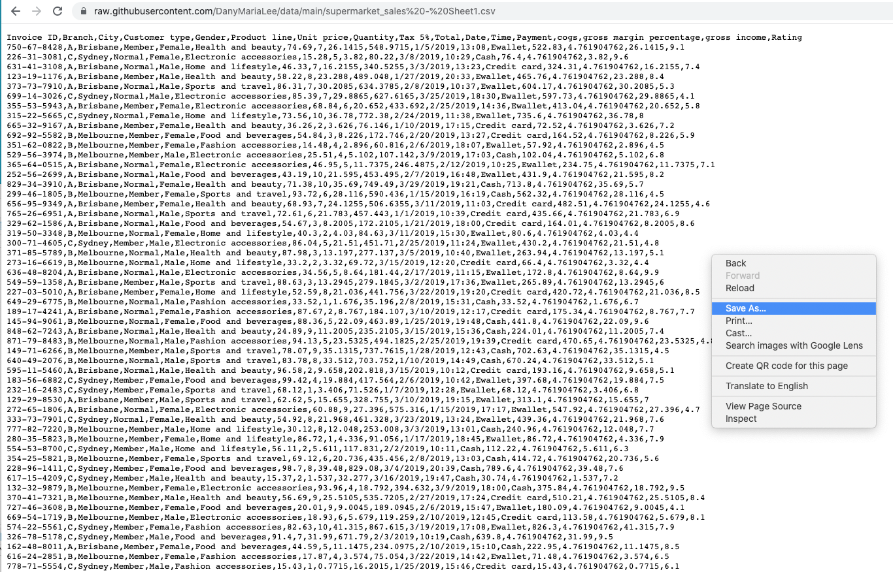
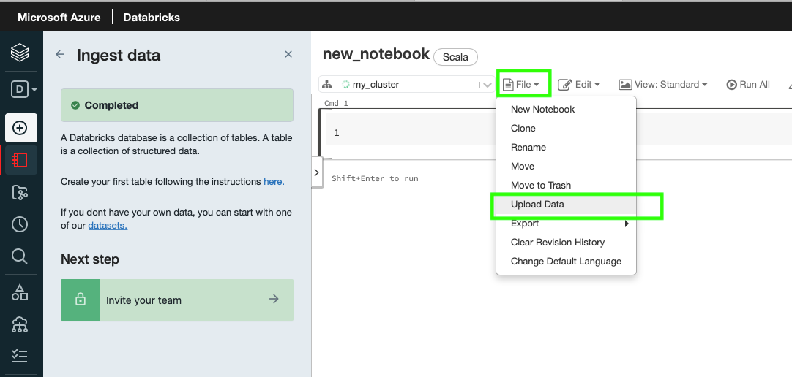
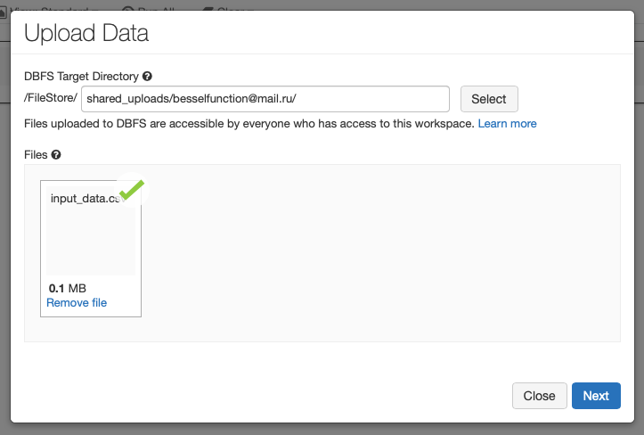
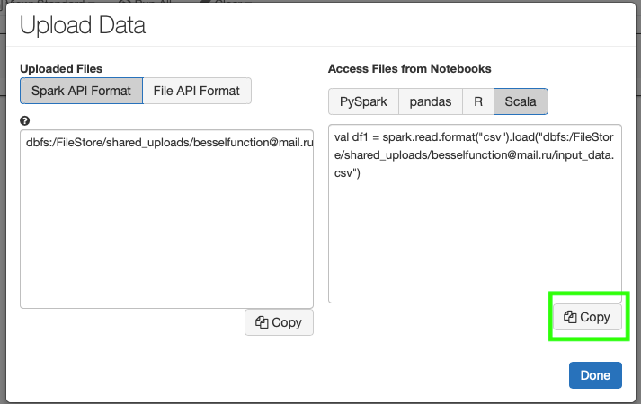
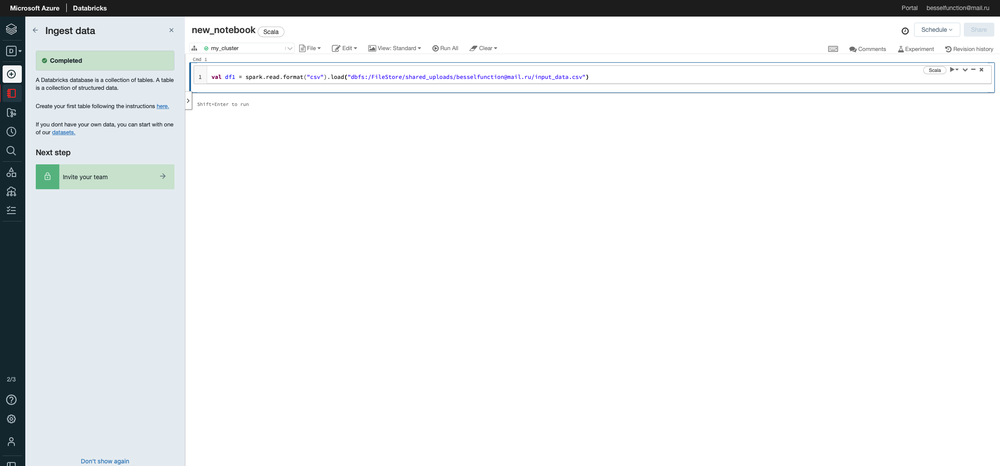

# Congratulations, you are a junior Data Engineer at Superstore!

We begin from creating cluster using Azure Databricks
On the left hand side at the tab bar: `Create -> Cluster -> enter name, change "Terminate after" to 30 min -> Change Max Workers onto 4 -> click Create Cluster`


Now we can create a Notebook
On the left hand side at the tab bar: `Create -> Notebook -> enter name, choose Scala and your cluster -> click Create`


Download the data for your warehouse

open this link in your browser
https://raw.githubusercontent.com/DanyMariaLee/data/main/supermarket_sales%20-%20Sheet1.csv

(This is raw CSV data of sales stats that we will be using in this class)

Right click on window "save as..." and save it as input_data.csv on your computer. We will use it in a minute.


Now let's ingest data!

Left tab -> Workspaces -> choose your workspace
Click file -> Upload data


then drag and drop our input_data.csv


And here click "copy" to get the code snippet to read the file


Paste copied code into the console


Before we run it let's look at the line of code and learn what it actually does

```scala
val df1 = spark.read.format("csv").load("dbfs:/FileStore/shared_uploads/besselfunction@mail.ru/input_data.csv")
```
spark - is Spark Session
.read - reads the data
.format - you provide info about the format of the data you are reading (csv, parquet)
.load parameter has to contain full path to the data


